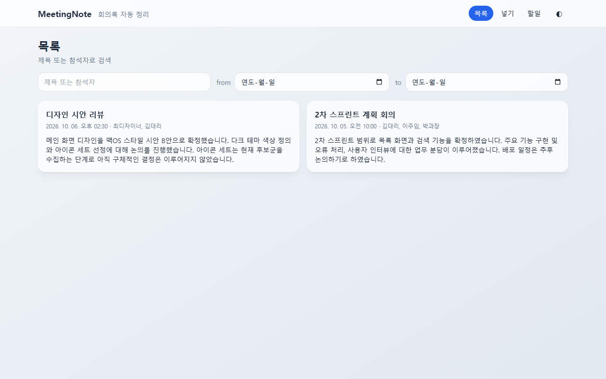
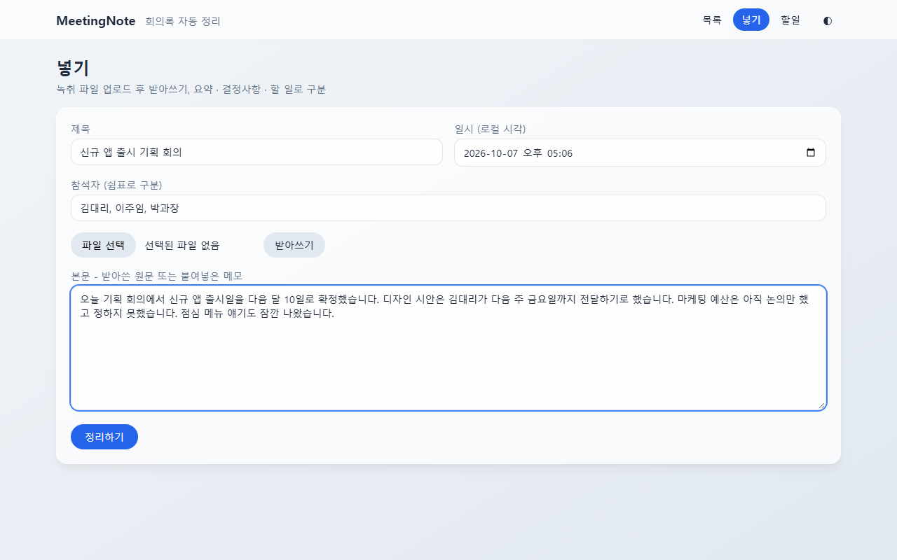
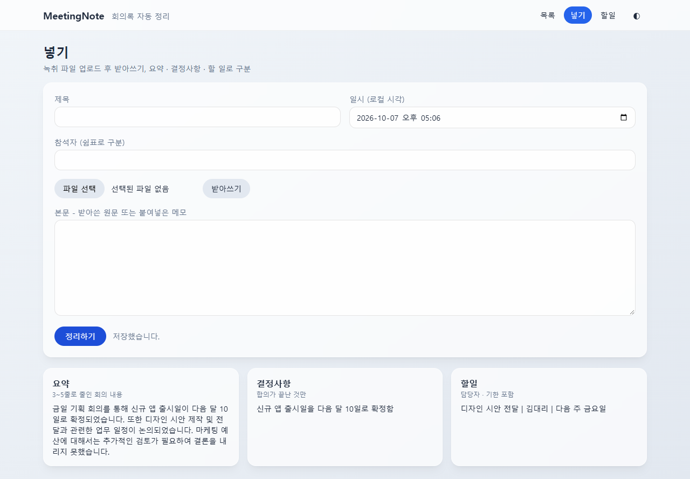
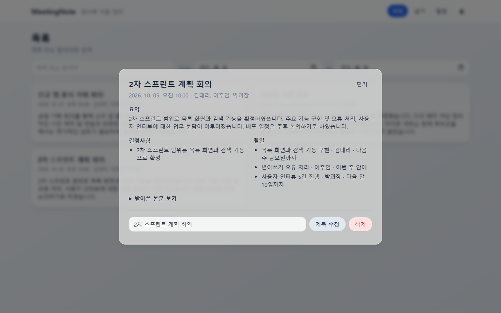
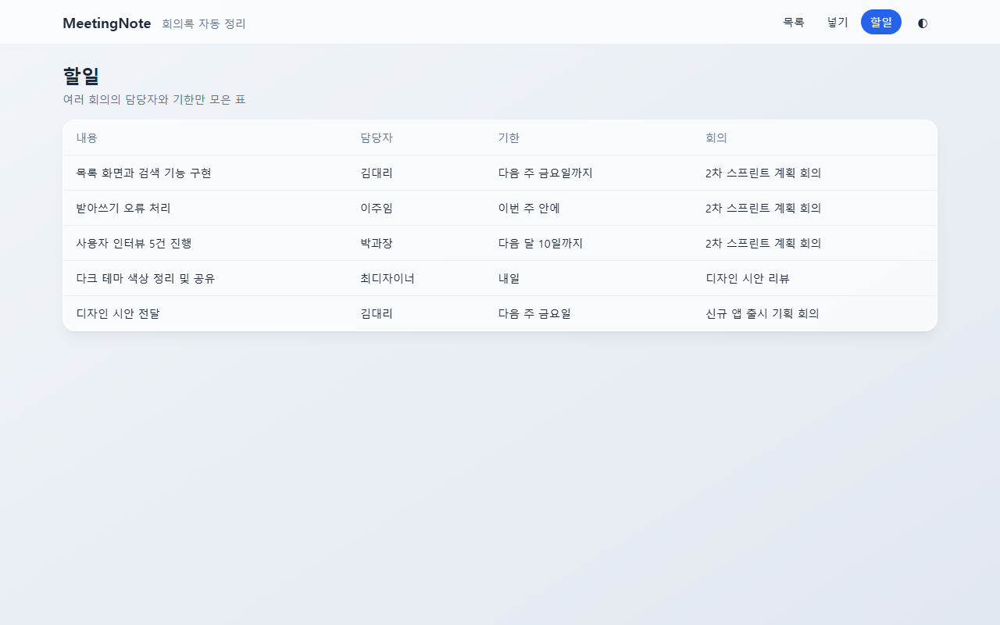
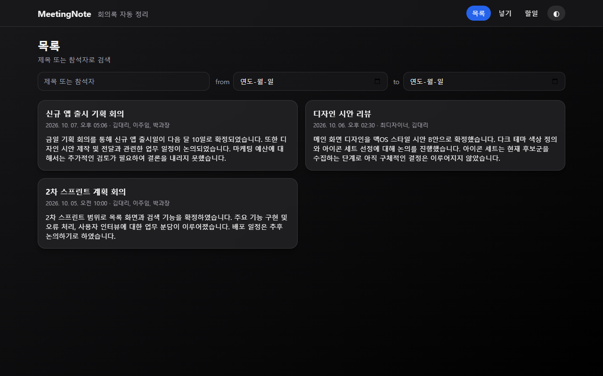
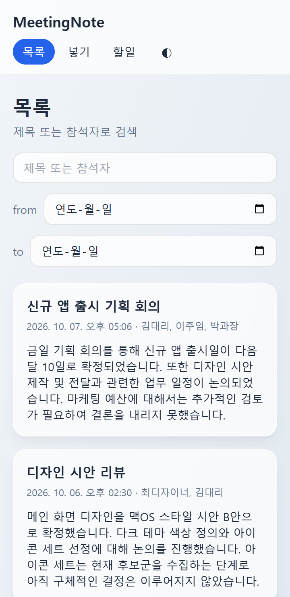
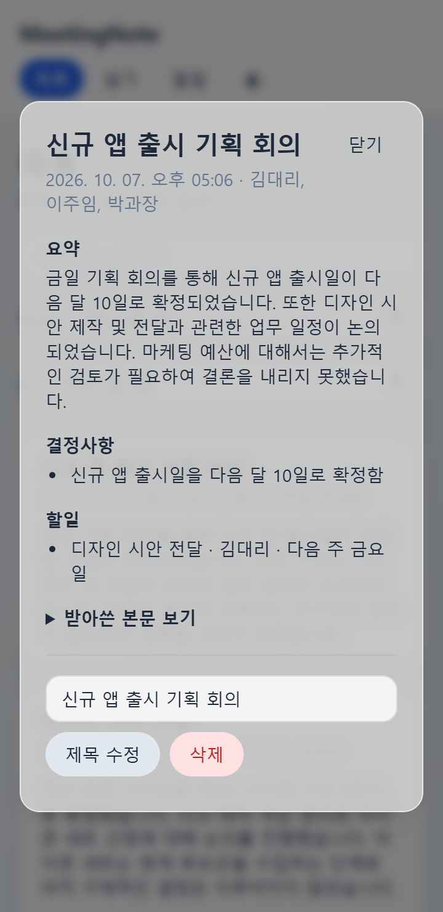
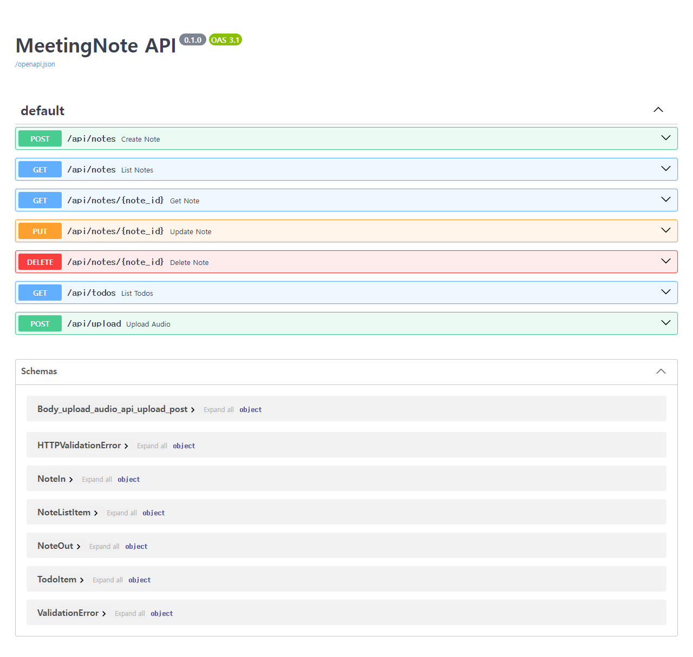

# MeetingNote

> 회의가 끝나면 정리가 끝나 있게. **"그때 뭐라고 했더라"가 사라지는** 회의록 자동 정리 웹 앱.

녹취 파일을 올리거나 메모를 붙여넣으면 Gemini 가 **요약 / 결정사항 / 할 일** 세 갈래로 나눠 저장합니다.
여러 회의의 할 일만 모아 담당자와 기한을 한눈에 볼 수 있습니다.



---

## 주요 기능

| 기능 | 설명 |
|---|---|
| 녹취 받아쓰기 | mp3, wav (25MB 이하) 파일을 올리면 본문 텍스트로 받아씁니다 |
| 세 갈래 자동 구분 | 요약 · 결정사항 · 할 일로 나눠 저장합니다 |
| 회의록 CRUD | 추가 / 목록 / 수정 / 삭제를 모두 화면에서 합니다 |
| 검색 | 제목, 참석자, 날짜(from~to)로 지난 회의를 찾습니다 |
| 할 일 모아 보기 | 여러 회의의 할 일을 담당자·기한과 함께 한 표로 봅니다 |
| 라이트 / 다크 테마 | 토글하면 `localStorage` 에 저장되고, 처음에는 시스템 설정을 따릅니다 |
| 모바일 반응형 | 360px 폭에서도 깨지지 않습니다 |

---

## 화면 구성

### 1. 넣기 - 받아쓰기부터 정리까지

제목, 일시, 참석자를 입력하고 녹취 파일을 올려 **받아쓰기**를 누르면 본문이 채워집니다.
메모를 직접 붙여넣어도 됩니다. **정리하기**를 누르면 저장되면서 세 갈래로 나뉩니다.



정리 결과는 요약 · 결정사항 · 할일 세 칸으로 바로 보여 줍니다.



세 갈래를 나누는 기준은 다음과 같습니다.

| 갈래 | 기준 |
|---|---|
| 요약 | 회의 전체를 3~5줄로. 새로운 사실을 지어내지 않음 |
| 결정사항 | "하기로 했다 / 확정 / 승인"처럼 합의가 끝난 것만. 논의만 하고 안 정한 것은 제외 |
| 할 일 | 담당자와 기한이 드러난 것만. 담당자가 없으면 `미정` |
| 그 외 | 어디에도 안 들어가는 잡담은 버림 |

위 예시에서도 "마케팅 예산은 논의만 했다"는 결정사항에서 빠지고, 잡담(점심 메뉴)은 버려졌습니다.

### 2. 목록과 상세

저장한 회의록은 카드로 표시됩니다. 검색은 입력할 때마다 다시 불러옵니다.
카드를 누르면 가운데 겹침 창으로 상세가 열립니다.



- 받아쓴 원문은 접어 두었다가 필요할 때 펼쳐 봅니다.
- 제목은 그 자리에서 바로 수정합니다.
- 삭제는 **한 번 더 눌러야** 지워집니다. 실수로 지우지 않도록 한 장치입니다.
- 바깥 어두운 영역을 누르거나 `Esc` 를 누르면 닫힙니다.

### 3. 할 일

여러 회의의 할 일만 모아 담당자, 기한, 어느 회의에서 나왔는지 보여 줍니다.
기한은 회의에서 말한 그대로("다음 주 금요일") 둡니다. 날짜로 바꾸지 않습니다.



### 4. 다크 테마와 모바일



| 목록 (360px) | 상세 (360px) |
|---|---|
|  |  |

---

## 기술 스택

스택은 고정이며 임의로 바꾸지 않습니다.

| 영역 | 사용 기술 |
|---|---|
| 백엔드 `backend/` | FastAPI, Python 3.11 이상, SQLite (SQLAlchemy ORM) |
| 프론트 `frontend/` | Vanilla JS + Tailwind CDN (`index.html`, `app.js` 2개 파일) |
| 받아쓰기·구분 | Gemini API (`gemini-3.1-flash-lite`) |
| 테스트 | pytest, Playwright(화면 확인) |

프론트는 백엔드가 **같은 오리진**에서 제공합니다. 그래서 CORS 설정이 필요 없고, `file://` 로 직접 열지 않습니다.

---

## 시작하기

### 1. 준비

- Python 3.11 이상
- Gemini API 키

### 2. 설치

```powershell
cd backend
python -m venv .venv
.venv\Scripts\activate
pip install fastapi uvicorn sqlalchemy pytest httpx google-genai python-multipart python-dotenv
```

### 3. 환경 변수

프로젝트 루트(`meetingnote/`)에 `.env` 파일을 만듭니다. 키는 코드에 쓰지 않고 `.env` 로만 읽습니다.

```
GEMINI_API_KEY=여기에_키를_입력
GEMINI_MODEL=gemini-3.1-flash-lite
```

`.env` 는 `.gitignore` 에 들어 있어 저장소에 올라가지 않습니다.

### 4. 실행

```powershell
cd backend
uvicorn app.main:app --port 8000
```

| 주소 | 내용 |
|---|---|
| http://localhost:8000/ | 앱 화면 |
| http://localhost:8000/docs | Swagger (API 문서와 직접 호출) |

서버 포트는 **8000** 으로 고정입니다.

---

## REST API

모든 경로는 `/api/` 로 시작합니다.

| 메서드 | 경로 | 성공 | 설명 |
|---|---|---|---|
| POST | `/api/notes` | 201 | 저장하며 세 갈래 구분까지 |
| GET | `/api/notes` | 200 | 목록. `q`(제목·참석자), `from`·`to`(날짜) |
| GET | `/api/notes/{id}` | 200 | 단건 (본문 포함) |
| PUT | `/api/notes/{id}` | 200 | 수정 |
| DELETE | `/api/notes/{id}` | 204 | 삭제 |
| GET | `/api/todos` | 200 | 할 일 모아 보기 (회의 날짜 오래된 순) |
| POST | `/api/upload` | 200 | 녹취 파일을 받아 본문 텍스트로 반환 |

오류 응답은 다음과 같습니다.

| 상황 | 코드 |
|---|---|
| `title` / `met_at` / `body` 누락, 형식 오류 | 400 |
| 없는 id | 404 |
| mp3, wav 가 아닌 파일 | 415 |
| 25MB 초과 파일 | 413 |
| 스펙 외 필드 | 422 |
| 받아쓰기 외부 호출 실패 | 502 |

받아쓰기나 구분이 실패해도 회의록은 저장됩니다. 이때 요약·결정사항·할 일은 빈 값이 되고, 화면에는 "구분 실패"로 표시합니다.



---

## 테스트

```powershell
cd backend
pytest
```

테스트도 **실제 Gemini 를 호출**합니다. 받아쓰기와 세 갈래 구분이 진짜 되는지는 실제로 불러 봐야 알 수 있기 때문입니다.
한도에 걸리지 않도록 Gemini 를 부르는 테스트는 호출 사이를 1초 띄웁니다. 그래서 실행에 25초 안팎이 걸립니다.

| 검증 | 범위 | 결과 |
|---|---|---|
| pytest | 테스트 매트릭스 13케이스 (정상·검색·400·404·422·415·413 등) | 13/13 통과 |
| Swagger E2E (Playwright) | 7개 API 를 Swagger UI 에서 직접 실행 15건 | 15/15 통과 |
| 화면 사용자 테스트 (Playwright) | 360px, 저장·새로고침 유지, 검색, 상세, 테마 23건 | 23/23 통과 |

Swagger E2E 보고서와 스크립트는 [`backend/tests/e2e/`](backend/tests/e2e/) 에 있습니다.

---

## 폴더 구조

```
meetingnote/
├── CLAUDE.md          # 작업 규칙 (역할, 기술 스택, 절대규칙)
├── README.md
├── .env               # API 키 (저장소에 올리지 않음)
├── backend/
│   ├── app/           # FastAPI 앱 (main, models, schemas, gemini, ...)
│   └── tests/         # pytest, e2e/ (Swagger E2E)
├── frontend/
│   ├── index.html
│   └── app.js
└── docs/              # 설계 문서 6종
```

---

## 문서

작업 전에 `docs/` 의 6개 문서를 아래 순서로 읽습니다.

| 순서 | 문서 | 내용 |
|---|---|---|
| 1 | [00-overview.md](docs/00-overview.md) | 개요와 문서 지도 |
| 2 | [01-product.md](docs/01-product.md) | 목표, 페르소나, MVP 범위, 성공 기준 |
| 3 | [02-specs.md](docs/02-specs.md) | 모델, API, 검증, 오류 코드 |
| 4 | [03-design.md](docs/03-design.md) | 기술·디자인 결정 8가지와 화면 요소 id |
| 5 | [04-tasks.md](docs/04-tasks.md) | Phase 3개 작업 목록과 진행 상태 |
| 6 | [05-conventions.md](docs/05-conventions.md) | 명명, 금지 사항, 테스트 매트릭스, 커밋 규칙 |

화면 배치와 요소 이름은 [`docs/화면구성.pdf`](docs/화면구성.pdf) 를 따릅니다.

---

## 개발 원칙

이 프로젝트는 아래 6가지 절대규칙으로 유지보수성을 지킵니다.

1. 추측하지 않는다.
2. 승인 없이 새 의존성을 추가하지 않는다.
3. 테스트 없이 완료라고 하지 않는다.
4. API 키를 하드코딩하지 않는다. `.env` 로만 읽는다.
5. 폴더 구조를 임의로 바꾸지 않는다.
6. docs 와 어긋나는 지시는 구현 전에 문서명과 조항을 들어 되묻는다.

---

## 확장 계획

- JWT 로그인
- 팀 공유
- 화자 구분
- 알림

범위 밖: 실시간 녹음, 화자 자동 구분, 외부 캘린더 연동, 메일 발송, 25MB 넘는 파일의 분할 업로드.
